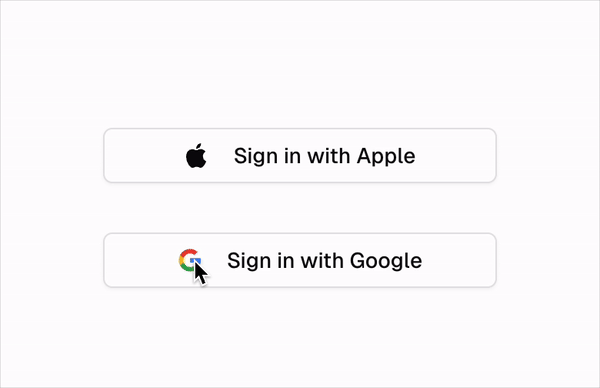

# Nextjs + Appwrite + Sign in with Apple or Google



## Demo

[https://next-appwrite-oauth.hip.dev](https://next-appwrite-oauth.hip.dev)

## Getting Started

Before using OAuth 2 login, you need to [enable and configure an OAuth 2 login provider](https://stage.appwrite.io/docs/products/auth/oauth2).

1. Navigate to your Appwrite project.
1. Navigate to Auth > Settings.
1. Find and open the OAuth provider.
1. In the OAuth 2 settings modal, use the toggle to enable the provider.
1. Create and OAuth 2 app on the provider's developer platform.
1. Copy information from your OAuth2 provider's developer platform to fill the OAuth2 Settings modal in the Appwrite Console.
1. Configure redirect URL in your OAuth 2 provider's developer platform. Set it to URL provided to you by OAuth2 Settings modal in Appwrite Console.
1. You will need to set up your

## App changes

### Install deps

```bash
npm install
```

### Copy set your public env vars

```bash
cp .env.example .env.local
```

```bash
# .env.local
NEXT_PUBLIC_APPWRITE_ENDPOINT=
NEXT_PUBLIC_APPWRITE_PROJECT_ID=
NEXT_PUBLIC_OAUTH_REDIRECT_URL=
```

### Start the app

```bash
# start app
npm run dev
```

Open [http://localhost:3000](http://localhost:3000) with your browser to see the result.
